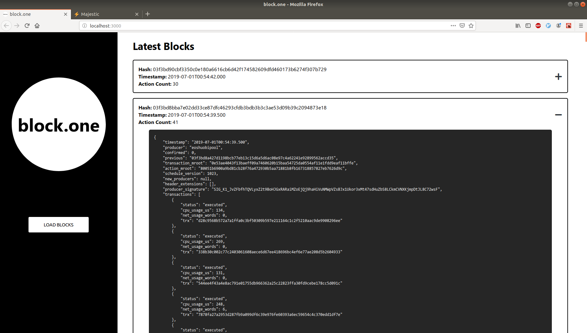
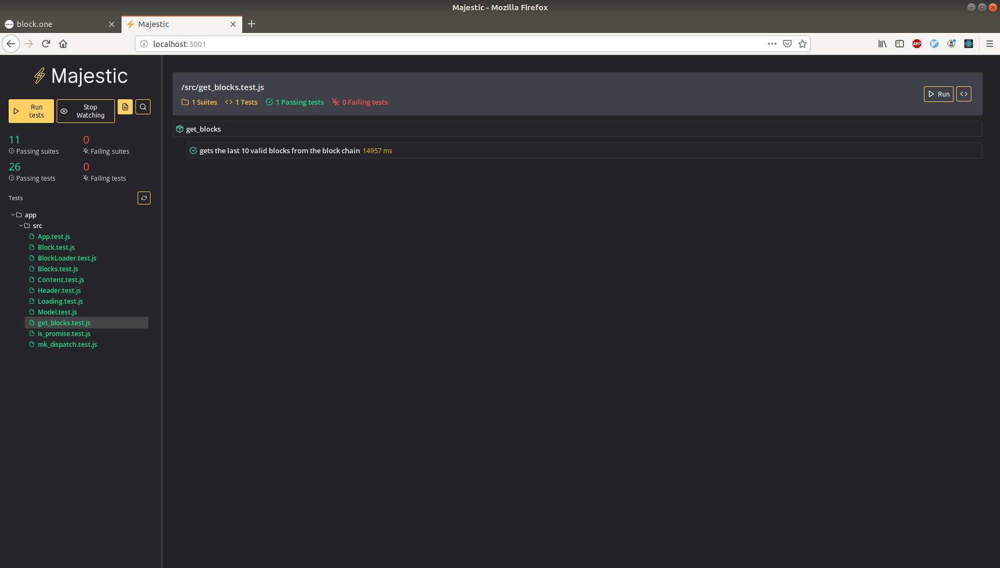

# Block One Viewer

Shows the last 10 blocks on the [Block.one](https://block.one/) blockchain, fetched from <https://api.eosnewyork.io>. Utilizes [EOSJS](https://github.com/EOSIO/eosjs) to retrieve block information.

View live demo at <https://ryantate13.github.io/block-one/>.

## Running the application

Clone this repository locally. The project's Makefile contains targets for launching and running the test suite. The development environment, powered by [create-react-app](https://github.com/facebook/create-react-app), and the test UI, running [Jest](https://github.com/facebook/jest) in the browser via [Majestic](https://github.com/Raathigesh/majestic), will be available on local ports 3000 and 3001 respectively. Launching the application requires Docker and docker-compose (1.13.0+) to be installed on the host machine.

### Launch the Web UI and Test Runner

In the project folder, run:

```
make run
```

#### Block Viewer

Available at <http://localhost:3000/>.




#### Web UI for Jest

Available at <http://localhost:3001/>.



### Generate a Code Coverage Report

To run the test suite in Docker and generate a coverage report in the terminal, run:

```
make test
```

Output should be similar to that shown below.

```
PASS src/mk_dispatch.test.js
  mk_dispatch function
    ✓ generates an asynchronous event dispatcher (10ms)
    ✓ can handle synchronous events (3ms)
    ✓ can handle asynchronous events (2ms)

PASS src/BlockLoader.test.js
  <BlockLoader />
    ✓ generates a button (27ms)
    ✓ calls dispatch when clicked (7ms)
    ✓ is disabled when loading (5ms)
    ✓ supports ghost style (8ms)

PASS src/Header.test.js
  <Header />
    ✓ generates a header (25ms)
    ✓ shows a block loader when data is present in content area (35ms)

PASS src/Block.test.js
  <Block />
    ✓ generates a block div (45ms)
    ✓ calls dispatch when toggle clicked (13ms)
    ✓ has open class when opened (4ms)

PASS src/Content.test.js
  <Content />
    ✓ generates the main content area (55ms)
    ✓ displays error messages when present (26ms)
    ✓ shows blocks when data is present (26ms)

PASS src/is_promise.test.js
  ✓ can tell whether something is a promise (3ms)

PASS src/Blocks.test.js
  <Blocks />
    ✓ renders an array of blocks (39ms)

PASS src/Loading.test.js
  <Loading />
    ✓ generates a spinner (4ms)

PASS src/App.test.js
  ✓ renders without crashing (27ms)

PASS src/Model.test.js (16.693s)
  Model
    ✓ creates an empty state object with the correct values (10ms)
    ✓ logs an error on unmatched event types (3ms)
    ✓ fetches blocks and sets loading state (13903ms)
    ✓ sets blocks with default open state and resets loading state (2ms)
    ✓ handles error events (1ms)
    ✓ toggles block open state

PASS src/get_blocks.test.js (17.777s)
  get_blocks
    ✓ gets the last 10 valid blocks from the block chain (15181ms)

-----------------------|----------|----------|----------|----------|-------------------|
File                   |  % Stmts | % Branch |  % Funcs |  % Lines | Uncovered Line #s |
-----------------------|----------|----------|----------|----------|-------------------|
All files              |    61.68 |    43.86 |    64.44 |    56.84 |                   |
 App.js                |      100 |      100 |      100 |      100 |                   |
 Block.js              |      100 |      100 |      100 |      100 |                   |
 BlockLoader.js        |      100 |      100 |      100 |      100 |                   |
 Blocks.js             |      100 |      100 |      100 |      100 |                   |
 Content.js            |      100 |      100 |      100 |      100 |                   |
 Header.js             |      100 |      100 |      100 |      100 |                   |
 Loading.js            |      100 |      100 |      100 |      100 |                   |
 Model.js              |      100 |      100 |      100 |      100 |                   |
 block_type.js         |        0 |        0 |        0 |        0 |                   |
 blockchain_timeout.js |        0 |        0 |        0 |        0 |                   |
 get_blocks.js         |      100 |      100 |      100 |      100 |                   |
 index.js              |        0 |      100 |      100 |        0 |              7,12 |
 is_promise.js         |      100 |      100 |      100 |      100 |                   |
 mk_dispatch.js        |     87.5 |      100 |       75 |    85.71 |                10 |
 mock_block.js         |        0 |        0 |        0 |        0 |                   |
 serviceWorker.js      |        0 |        0 |        0 |        0 |... 23,130,131,132 |
-----------------------|----------|----------|----------|----------|-------------------|
Test Suites: 11 passed, 11 total
Tests:       26 passed, 26 total
Snapshots:   0 total
Time:        21.072s
Ran all test suites.
Done in 22.32s.
```

## Test Coverage

Testing components in isolation was easy to achieve 100% coverage on given that only the top level ```App``` component has any state. Each of the child components is a pure, functional component allowing props and event dispatching to be mocked and tested easily. I used Enzyme for shallow rendering and confirmed that the shape of the DOM was accurate for the functionality desired and that click events called the dispatch function with events that adhered to the correct shape.

I tested out a new state management pattern for this application based on React Hooks. Testing state transformations was drastically simplified with this approach. I placed my initial state and reducer in to their own module and created tests for each event type that was dispatched by components throughout the application. I introduced a system where a state transformation could actually return two parts, a new state object and a future event. This made asynchronous actions easy to deal with because the dispatch function takes care of checking the shape of the data returned from ```Model.reduce``` and determining if it should resolve a future event returned in the form of a promise and then recursively calling itself with the result. This meant my calls to load data could fire a single event and then the dispatch function and reducer handle the async call to get the data as well as handling the data once returned.

Unfortunately this introduces some complexity due to the way the ```useState``` hook works. All React hooks must be called in the function body of a React component which means the ```dispatch``` function can't be pre-declared. I created a HOF called ```mk_dispatch``` to handle this once the hook ran but had trouble getting 100% coverage of the dispatch function that gets returned. Using ```jest.fn``` to spy on ```setState```, I could tell that it gets called once for synchronous events and twice for asynchronous events meaning that the "future event promise" pattern works correctly. I intended for the behavior of caught promises to be to re-dispatched as events of type ```error``` though and haven't yet figured out a good test for this case.

## Issues with the Block.one API

I encountered an issue withe the JSON RPC calls using EOSJS where quite a number of calls to get information on a block calling ```getBlock(id)``` would fail with a 404. I wasn't able to hit the info endpoint and just fetch the most recent 10 values based on ```head_block_num``` because of this issue. This might be due to a lack of understanding on my part about how that process should work but I believe based on [this issue](https://github.com/EOSIO/eosjs/issues/19) that getting the ```head_block_num``` and then making N calls to ```getBlock``` is the intended behavior of the API. I also encountered an issue where if I made too many requests concurrently I would abut the rate limit of the API. As a workaround I made my ```get_blocks``` function async and sprinkled calls to wait for a second throughout the code and fetch new results in a while loop until not only the info endpoint returns data but I've made enough successful ```getBlock``` calls to get 10 results to show. Not necessarily ideal but it ensures that eventually data comes back and has the correct number of items. An unfortunate consequence though is that test runs against the API can take upwards of 15 seconds to complete. Testing against the actual API instead of a mock allowed me to refine the process to the point where it was pretty rock solid though so I decided the wait was worth it.  